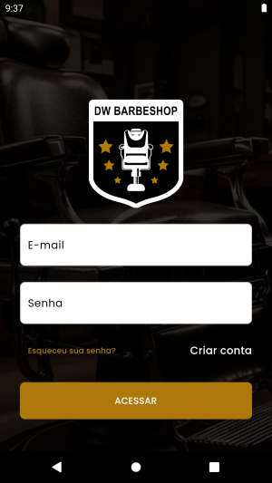
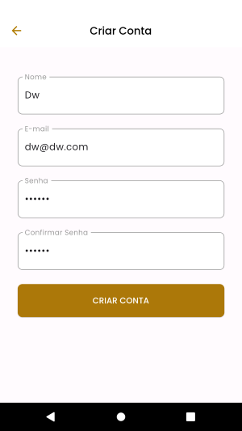
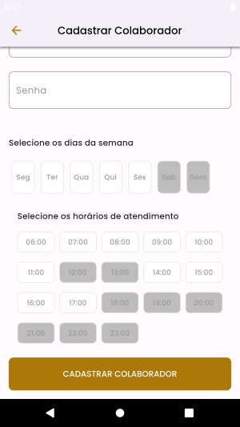
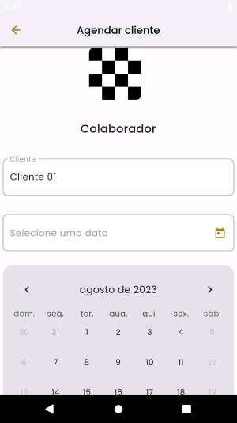
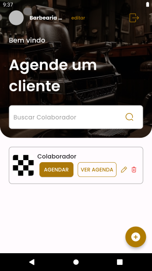

<p align="left">

  
  
  
  

</p>


### Tópicos 

:small_blue_diamond: [Sobre o Projeto](#star-sobre-o-projeto)

:small_blue_diamond: [Objetivo](#dart-objetivo)

:small_blue_diamond: [Imagens](#sunrise_over_mountains-imagens)

:small_blue_diamond: [Pacotes Utilizados](#gear-pacotes-utilizados)

:small_blue_diamond: [Como rodar a aplicação](#arrow_forward-como-rodar-a-aplicação)

## :star: Sobre o Projeto 

Aplicação desenvolvida durante a Dart Week 11, evento gratuito organizado pela Academia do Flutter (https://academiadoflutter.com.br/).

Este projeto foi desenvolvido utilizando:

:heavy_check_mark: Flutter 
:heavy_check_mark: Riverpod para gerenciamento de estado e injeção de dependência.
:heavy_check_mark: json_rest_server para simualação de um back-end.

## :dart: Objetivo

Desenvolvimento de um aplicativo para agendamentos de uma barbearia.

### Funcionalidades:

:white_check_mark: Efetuar Login 
:white_check_mark: Criar conta
:white_check_mark: Cadastrar estabelecimento
:white_check_mark: Cadastrar colaborador
:white_check_mark: Agendar cliente
:white_check_mark: Visualizar agenda

### Backlog:

:black_square_button: Editar agenda
:black_square_button: Excluir agenda
:black_square_button: Upload de imagens do perfil
:black_square_button: Edição do perfil
  
## :sunrise_over_mountains: Imagens

### :iphone: Mobile


#### :white_check_mark: Login


#### :white_check_mark: Criar conta



#### :white_check_mark: Cadastrar estabelecimento


####  :white_check_mark: Cadastrar colaborador




####  :white_check_mark: Agendar cliente






####  :white_check_mark: Visualizar agenda


##### Detalhes do Pedido


## :gear: Pacotes Utilizados 

### :station: Server
- :white_check_mark:[Json Rest Server](https://pub.dev/packages/json_rest_server)


### :iphone: Web

 :white_check_mark:[flutter_riverpod](https://pub.dev/packages/flutter_riverpod)
 :white_check_mark:[riverpod_annotation](https://pub.dev/packages/riverpod_annotation)
 :white_check_mark:[asyncstate](https://pub.dev/packages/asyncstate)
 :white_check_mark:[loading_animation_widget](https://pub.dev/packages/loading_animation_widget)
 :white_check_mark:[dio](https://pub.dev/packages/dio)
 :white_check_mark:[shared_preferences](https://pub.dev/packages/shared_preferences)
 :white_check_mark:[validatorless](https://pub.dev/packages/validatorless)
 :white_check_mark:[top_snackbar_flutter](https://pub.dev/packages/top_snackbar_flutter)
 :white_check_mark:[table_calendar](https://pub.dev/packages/table_calendar)
 :white_check_mark:[intl](https://pub.dev/packages/intl)
 :white_check_mark:[syncfusion_flutter_calendar](https://pub.dev/packages/syncfusion_flutter_calendar)
 :white_check_mark:[dev:custom_lint](https://pub.dev/packages/custom_lint)
 :white_check_mark:[dev:riverpod_lint](https://pub.dev/packages/riverpod_lint)
 :white_check_mark:[dev:riverpod_generator](https://pub.dev/packages/riverpod_generator)
 :white_check_mark:[dev:build_runner](https://pub.dev/packages/build_runner)


## :arrow_forward: Como rodar a aplicação 

#### :warning: Pré-Requisitos

- [Git](https://git-scm.com/)

#### :heavy_check_mark: Clonando o Projeto

No terminal, clone o projeto: 

```
https://github.com/dgo-angelo/dw11_barbershop.git
```

### :station: Server

#### :warning: Pré-Requisitos

- :link: [Dart](https://dart.com)


#### :arrow_forward: Executando a aplicação

1) Acessar a pasta ```server``` do projeto
2) Executar o comando abaixo, que disponibilizará a api no endereço http://localhost:8080
```
json_rest_server run
```

3) A API disponibiliza os seguintes endpoints:

| Método                                 | Verbo HTTP | Endpoint                         | Autenticação? |
|----------------------------------------|------------|----------------------------------|---------------|
| Registra uma nova barbearia            | POST       | http://localhost:8080/barbershop | Sim           |
| Atualiza uma barbearia                 | PUT        | http://localhost:8080/barbershop | Sim           |
| Lista todas as barbearias              | GET        | http://localhost:8080/barbershop | Sim           |
| Login                                  | POST       | http://localhost:8080/auth       | Não           |
| Retorna o perfil do colaborador logado | GET        | http://localhost:8080/me         | Sim           |
| Retorna a lista de colaboradores       | GET        | http://localhost:8080/users      | Sim           |
| Registra um novo colaborador           | POST       | http://localhost:8080/users      | Sim           |
| Registra um novo agendamento           | POST       | http://localhost:8080/schedules  | Sim           |
| Retorna os  agendamentos               | GET        | http://localhost:8080/schedules  | Sim           |
| Atualiza um agendamento                | PUT        | http://localhost:8080/schedules  | Sim           |

### :iphone: Mobile

#### :warning: Pré-Requisitos

- [Dart](https://dart.dev/get-dart)
- [Flutter](https://docs.flutter.dev/get-started/install)

#### :arrow_forward: Executando a aplicação

Acessar o arquivo main.dart, e pressionar F5, ou executar o comando abaixo na raiz do projeto:

```
 flutter run -d all
```

Antes de executar, verifique se você possuí um dispositivo ou emulador pronto para ser utilizado.

Abra a paleta de comandos e digite : ```Flutter``` e a seguir a opção ```Select a device```;

Será aberta uma janela exibindo os dispositivos android disponíveis. Basta selecionar o desejado.

<hr/>